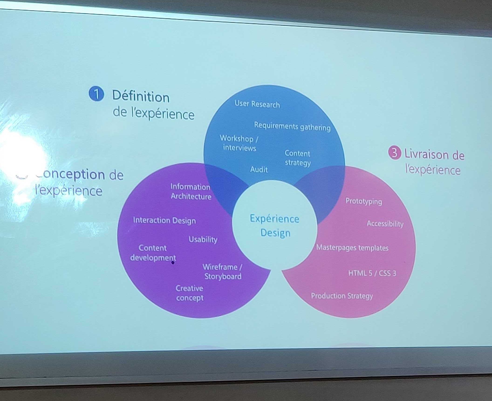

# Qualité projet web

**good design is problem solving**

## UX
Simplifier la vie des gens, il ne s'applique pas uniquement au design (dans la vie de tous les jours).

## UX vs UI :
**UI :**
- Surface 

**UX :**
- Squelette 
- Structure
- Cadre
- Stratégie

Une interface utilisateur c'est un peu comme une blague si ont doit l'expliquer c'est qu'elle est pas bonne.

## Expérience Design :

