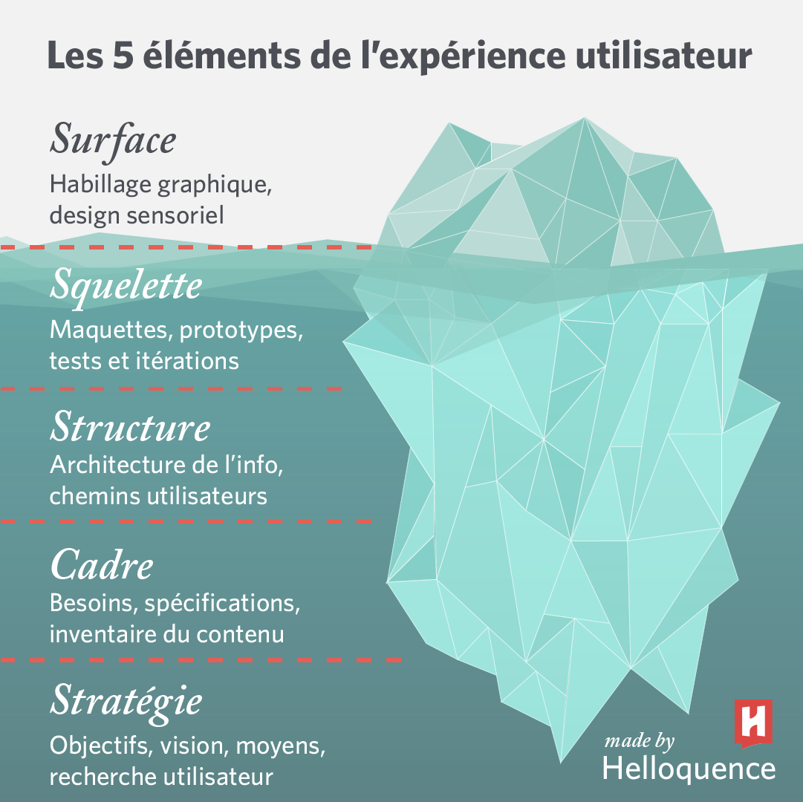
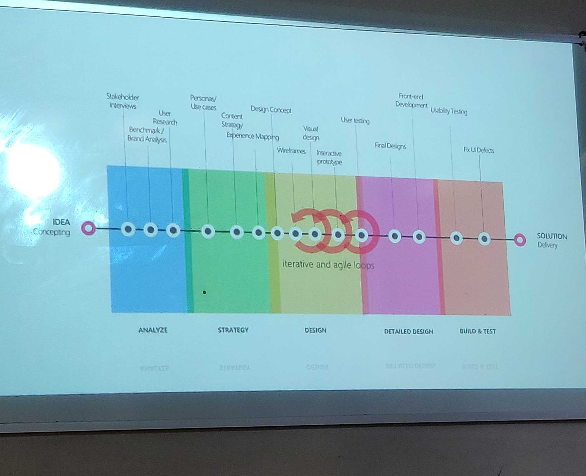
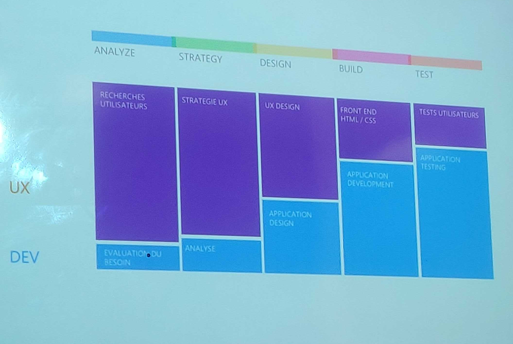

# Qualité projet web

**good design is problem solving**

## UX
Simplifier la vie des gens, il ne s'applique pas uniquement au design (dans la vie de tous les jours).

## UX vs UI :
**UI :**
- Surface 

**UX :**
- Squelette 
- Structure
- Cadre
- Stratégie

Une interface utilisateur c'est un peu comme une blague si ont doit l'expliquer c'est qu'elle est pas bonne.

## Expérience Design :

**Design système :**

le Design System définit le design des plus petits éléments (textes, titres, formulaires) aux grilles, palettes de couleurs, blocs ou composants

Exemple de design système : 
- https://material.io/

## Dev & UX : 

Faire de l'UX c'est surtout des méthodes.

## Les différents metier autours de l'UX : 

|||
|---|---|
|Ux Manager|il définit eet porte la vision d'UX, soutint l'équipe dans sa mise en oeuvre, tout en veillant à la cohérence globale. il pilote la connaissance des attentes clients et diffuse la culture du design centré sur l'utilisateur.|
|Ux research|Charé de mener les activités qui permettent de comprendre les besoins, les attentes, les objectifs et les comportements des clients. Entretiens, enquêtes, ateliers et tests utilisateurs sont les moyens par lesquels il fait émerger des insights précieux.|​​
|Ux designer|Il s'appuie sur une connaissance approfondie des services et des utilisateurs. L'UX designer travaille sur la conception des parcours et imagine des solutions pour rendre l'expérience aussi efficiente et agréable que possible .|
|UI designer|Le role de l'UI designer est de traduire la réflexion UX en maquettes graphique abouties. Ils travaille sur la structure des écrans, leurs apparence et les comportements de l'interface. Il matérialise l'identité des services.|
